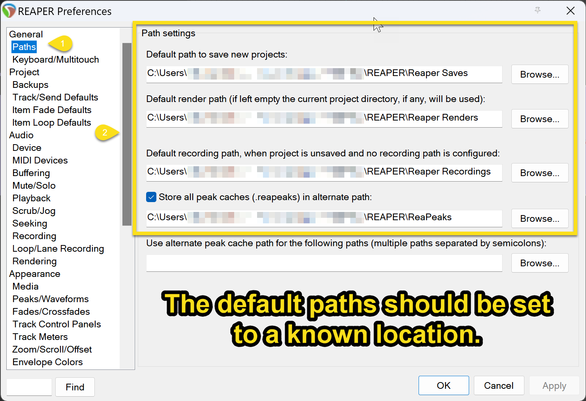
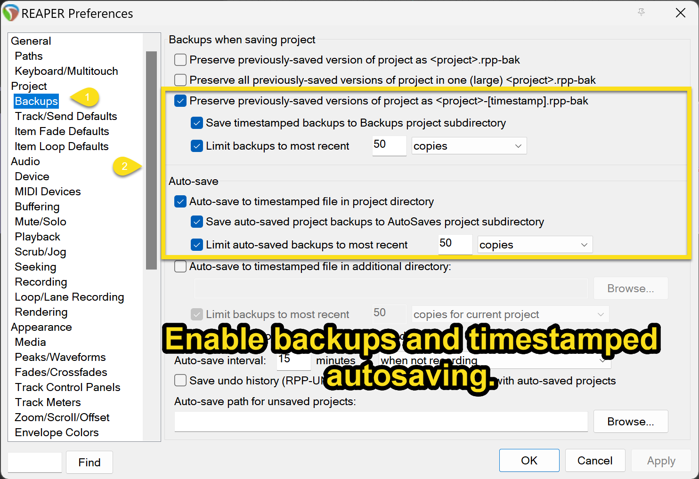
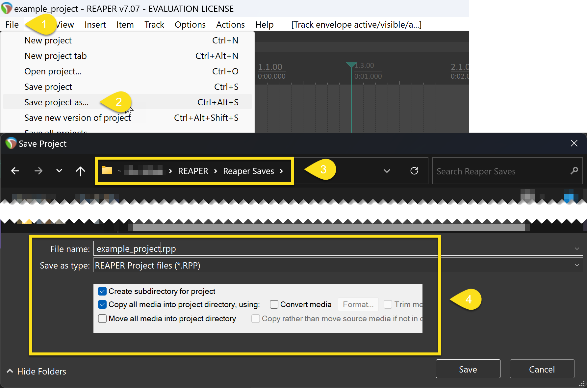

# Reaper Save Compressor by stigs

Simple and effective tool to archive and optionally encrypt your project directories for transit.

## Quick Start Guide

### Installation

1. **Run the Installer**: Double-click the installer and follow the on-screen instructions.
2. **Install 7-zip**: Ensure 7-Zip is installed on your system. Download from [7-Zip's official website](https://www.7-zip.org/).

### Using Reaper Save Compressor

1. **Open Reaper Save Compressor**: Use the shortcut created on your desktop or in the start menu.
2. **Choose a Directory**: Select the directory you wish to archive.
3. **Encryption (Optional)**: Choose whether to encrypt the archive. If yes, enter a secure password.
4. **Archiving**: The tool will archive and optionally encrypt your directory. A confirmation message will display the sizes of the original and compressed folders.

### Setting Up Reaper for Project Directories

To ensure Reaper saves files in a specific directory for easy archiving:

1. **Project Settings in Reaper**: 

&#8593; First, It is recommended that you set default paths for each different type of item. Create a root folder somewhere (named "REAPER" in the image), and create and set the subfolders show above.

&#8593; Next, It is recommended that you set backups up as shown above.
 
2. **Set Media Files Directory**:

Finally, select "File" > "Save project as...", then save your project in the Reaper Saves folder from earlier with the shown settings.

### Support and Troubleshooting

- For support or if you encounter any issues, email: stigs+reaper@stigsdomain.com
- Ensure 7-Zip is installed on your system. Download from [7-Zip's official website](https://www.7-zip.org/).

---

*Documentation version: 1.0 | Last updated: [1/2/2024]*

